# Natively 使用说明书

适用版本：普通用户版 + 提示词实验室  
适用平台：Windows  
界面语言：简体中文  
截图规范：暗色主题、演示数据、固定窗口尺寸

## 1. 产品概览与快速上手

Natively 是一款面向会议、面试与会后复盘场景的桌面 AI 助手。它把常用功能分成三层：

1. 首页与会前准备：查看最近会议、连接日历、开始会议、进入历史详情。
2. 会议中助手：实时转写、推荐回答、截图附加、模型切换、会中追问。
3. 会后整理与配置：会议详情、跨会议搜索、设置中心、授权中心、提示词实验室。

### 1.1 五分钟快速上手

1. 打开应用，先在首页确认最近会议和顶部状态。
2. 如需会前准备，先连接 Google 日历并刷新事件。
3. 点击“立即开始”或从最近会议进入详情页。
4. 会议中使用“怎么回答 / 精简 / 总结 / 追问建议 / 作答”完成实时辅助。
5. 会议结束后到“会议详情”或“全局搜索”继续整理内容。

### 1.2 功能覆盖矩阵

| 功能组 | 是否纳入 | 对应章节 | 主要截图 |
| --- | --- | --- | --- |
| 启动页与首页 | 是 | 第 2 章 | 图 2-1 |
| 日历接入与刷新 | 是 | 第 2 章 | 图 2-2 |
| 开始会议 / 提前准备 | 是 | 第 2 章 | 图 2-1、图 2-2 |
| 会议中悬浮助手 | 是 | 第 3 章 | 图 3-1 |
| 截图附加与模型切换 | 是 | 第 3 章 | 图 3-2、图 3-3 |
| 会议历史与详情 | 是 | 第 4 章 | 图 4-1 |
| 会议内追问 | 是 | 第 4 章 | 图 4-2 |
| 全局搜索 | 是 | 第 4 章 | 图 4-3 |
| 设置 7 个 Tab | 是 | 第 5 章 | 图 5-1 至图 5-7 |
| 授权与升级 | 是 | 第 6 章 | 图 6-1 |
| 提示词实验室 | 是 | 第 7 章 | 图 7-1 |
| 调用链 / 原始转写 / Fun-ASR 对比 / Queue / Solutions / Debug | 否 | 不在本文 | 不适用 |

### 1.3 术语说明

- 悬浮助手：会议进行中的主界面。
- 会议详情：单场会议的摘要、转录与 AI 记录页。
- 全局搜索：跨全部会议记录的问答搜索页。
- 职业画像：基于简历、项目与 JD 生成的本地知识库能力。
- 提示词实验室：预览并调整 AI 各动作输入的实验窗口。

## 2. 首页与会前准备

### 2.1 首页总览

**用途**  
查看最近会议、切换首页可见状态、打开设置、开始新会议。

**入口**  
启动应用后默认进入首页。

**操作步骤**
1. 观察顶部搜索栏、设置按钮和“启动 Natively”主按钮。
2. 查看中部功能卡片与下方最近会议列表。
3. 需要查看历史内容时，直接点击某一场会议记录。

**结果**  
你可以从同一页完成“开始会议”“进入历史详情”“打开设置”三类操作。

**注意事项**  
顶部的可见状态开关会影响会议中窗口的展示方式；如果你只想快速开会，直接使用右上角主按钮即可。

**配图**  
图 2-1 首页总览  
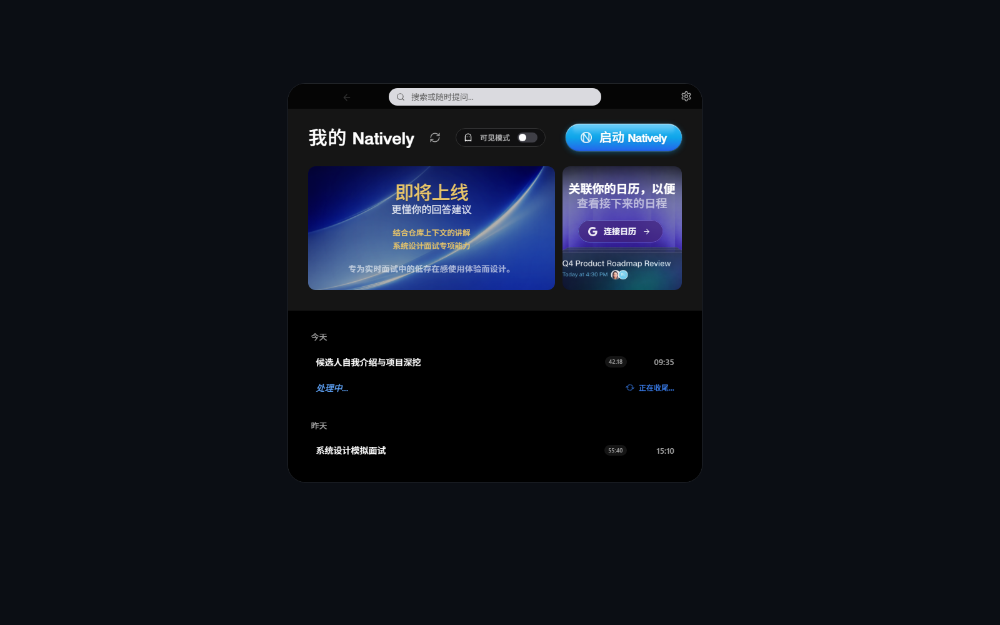

### 2.2 连接日历与刷新事件

**用途**  
把即将开始的会议同步到首页，方便会前准备和一键进入。

**入口**  
首页右侧日历卡片，或设置中的“日历”页。

**操作步骤**
1. 在首页点击“连接日历”或在设置里连接 Google 日历。
2. 连接成功后回到首页，点击刷新按钮同步最新事件。
3. 如果有即将开始的事件，可直接在首页看到对应会议信息。

**结果**  
首页会显示“日历已关联 / 事件已同步”状态，并把近期事件放入可准备队列。

**注意事项**  
如果连接后没有看到新事件，优先使用刷新按钮；若仍为空，请到设置中的“日历”页确认账号状态。

**配图**  
图 2-2 日历已连接状态  
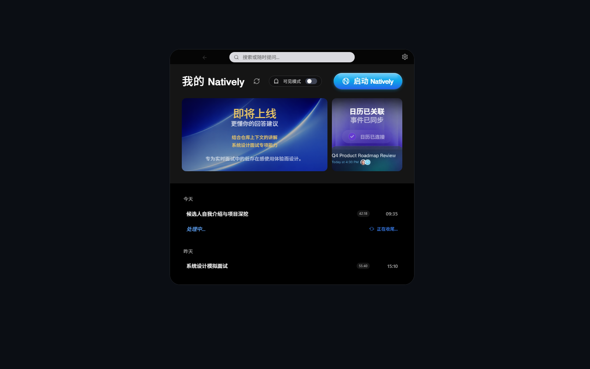

### 2.3 开始会议与提前准备

**用途**  
快速进入会议模式，或者围绕即将开始的会议做会前准备。

**入口**  
首页顶部“启动 Natively”按钮；连接日历后的准备卡片。

**操作步骤**
1. 立即开始新会议时，点击首页右上角主按钮。
2. 如果首页出现即将开始的日程卡片，优先点击“提前准备”。
3. 进入会议后，再根据需要附加截图、切换模型或使用快捷动作。

**结果**  
新会议会进入悬浮助手界面；已关联日历的会议会带上更完整的标题和上下文。

**注意事项**  
“立即开始”更适合临时会议；“提前准备”更适合已有日历事件、想提前组织回答重点的场景。

**配图**  
图 2-1 首页快速入口  

### 2.4 打开最近会议详情

**用途**  
查看单场会议的摘要、关键要点、待办事项与会后追问入口。

**入口**  
首页下方最近会议列表。

**操作步骤**
1. 在首页最近会议列表中点击任意一条会议。
2. 等待详情页加载完整摘要与转录。
3. 需要继续追问时，使用页面底部输入框。

**结果**  
你会进入单场会议详情页，并能继续围绕这场会议复盘。

**注意事项**  
如果某条记录仍显示“Processing...”，表示摘要仍在生成中，稍后刷新即可。

**配图**  
图 2-3 会议详情入口效果  
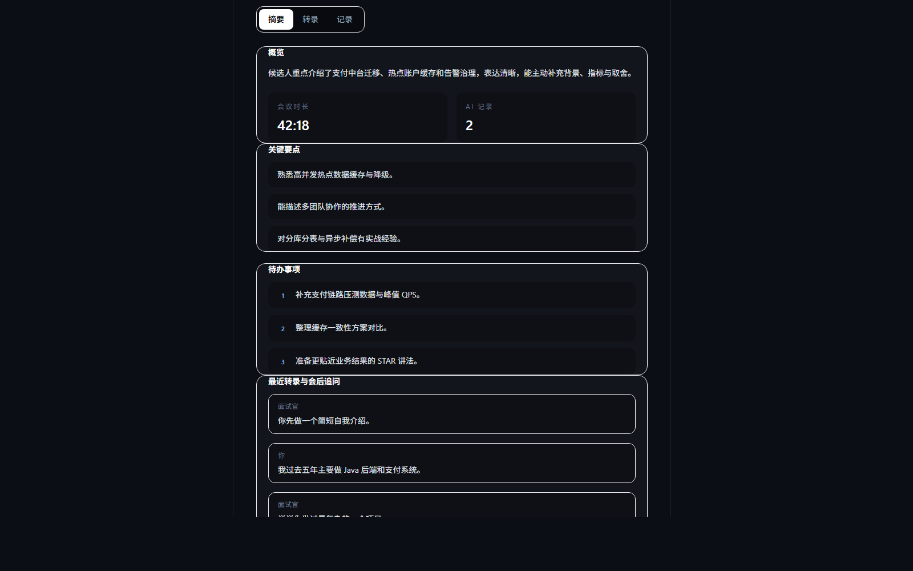

## 3. 会议中助手

### 3.1 悬浮助手主界面

**用途**  
在会议进行中查看实时转写、推荐回答和当前输入区。

**入口**  
从首页开始会议后自动进入。

**操作步骤**
1. 观察左侧对话区，确认转写是否持续更新。
2. 观察右侧推荐区，等待 AI 给出当前问题的建议答案。
3. 需要主动提问时，在底部输入框中直接输入问题。

**结果**  
悬浮助手会把会议内容、当前问题和 AI 推荐整合到一个窗口中。

**注意事项**  
实时推荐依赖当前转写内容；如果长时间没有更新，请先检查音频输入设备与权限。

**配图**  
图 3-1 会议中悬浮助手  

### 3.2 五个快捷动作

**用途**  
快速把当前上下文转成可直接使用的回答或整理结果。

**入口**  
悬浮助手底部动作条。

**操作步骤**
1. 点击“怎么回答”：生成当前问题的直接回答版本。
2. 点击“精简”：把已有答案压缩成更短、更口语化版本。
3. 点击“总结”：生成当前阶段的小结。
4. 点击“追问建议”：生成下一轮可能出现的问题。
5. 点击“作答”：按当前上下文生成一版完整回答。

**结果**  
不同动作会围绕同一场会议上下文给出不同输出形态。

**注意事项**  
如果你已经开启职业画像或附加了截图，这些动作会优先参考新增上下文。

**配图**  
图 3-1 动作区与推荐区  

### 3.3 附加截图

**用途**  
把屏幕内容作为额外上下文发送给 AI，用于解释页面、图表、代码或题目。

**入口**  
悬浮助手底部工具区；快捷键区也可配置对应按键。

**操作步骤**
1. 在会议中使用截图或框选截图功能。
2. 等待截图以缩略图形式附加到当前会话。
3. 再执行“怎么回答”或直接输入问题。

**结果**  
AI 会在已有转写之外，结合截图内容理解当前问题。

**注意事项**  
截图是会话级上下文；如果截图与当前问题无关，建议先清理后再继续提问。

**配图**  
图 3-2 已附加截图的会议中界面  
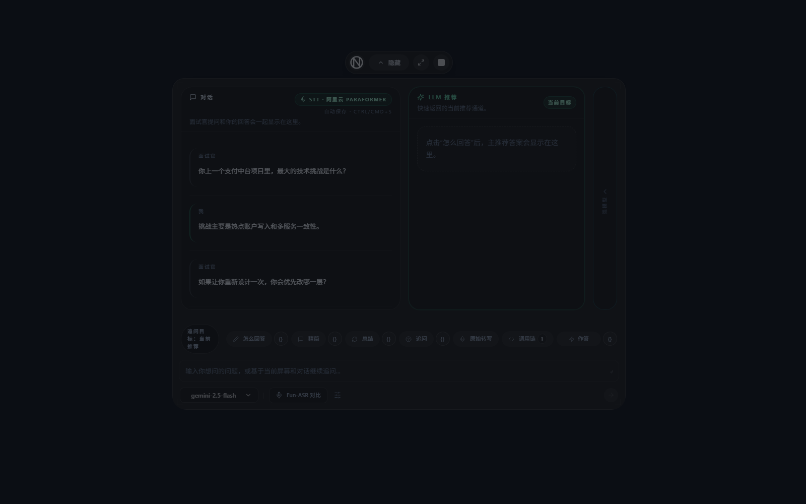

### 3.4 切换模型

**用途**  
在不同模型之间快速切换，以平衡速度、质量和可用性。

**入口**  
悬浮助手底部模型区域。

**操作步骤**
1. 点击当前模型名称。
2. 在弹出的模型列表中选择需要的模型。
3. 返回会议界面继续使用动作按钮或手动提问。

**结果**  
之后生成的新回答会使用你刚选中的模型。

**注意事项**  
模型列表会受当前 API Key、托管模式和本地模型可用性影响。

**配图**  
图 3-3 模型选择器  
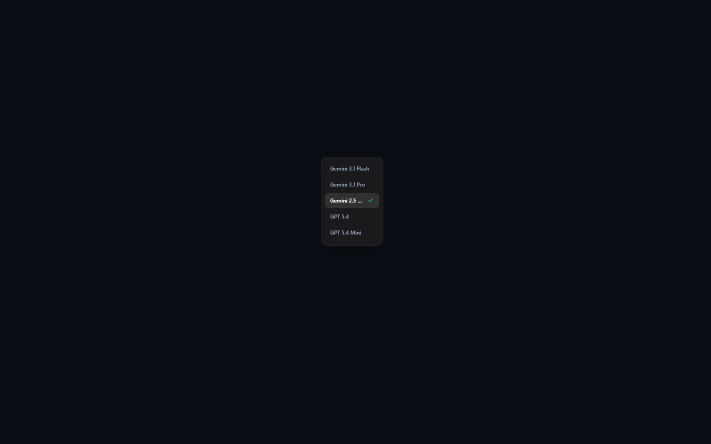

## 4. 会后查看与搜索

### 4.1 会议详情页

**用途**  
整理单场会议的概览、关键要点、待办事项和最近转录。

**入口**  
首页最近会议列表。

**操作步骤**
1. 打开某一场会议详情。
2. 阅读“概览”“关键要点”“待办事项”三个主要信息区。
3. 如需继续复盘，在页内底部输入框提问。

**结果**  
你可以把单场会议从“已结束记录”继续推进成“可复盘、可追问、可复制”的资料页。

**注意事项**  
这页更适合围绕单场会议做深挖；如果问题跨多场会议，请改用全局搜索。

**配图**  
图 4-1 会议详情页  

### 4.2 会议内追问

**用途**  
只在单场会议范围内继续问问题，避免混入其他会议信息。

**入口**  
会议详情页底部追问输入框。

**操作步骤**
1. 进入会议详情页后，在底部输入你的问题。
2. 等待系统基于当前这场会议的记录生成回复。
3. 如有需要，继续追问下一轮问题。

**结果**  
输出只围绕当前会议，不会跨会议混合内容。

**注意事项**  
适合问“这场会议里我哪里讲得不够好”“帮我总结这场会的改进点”这类问题。

**配图**  
图 4-2 会议内追问  
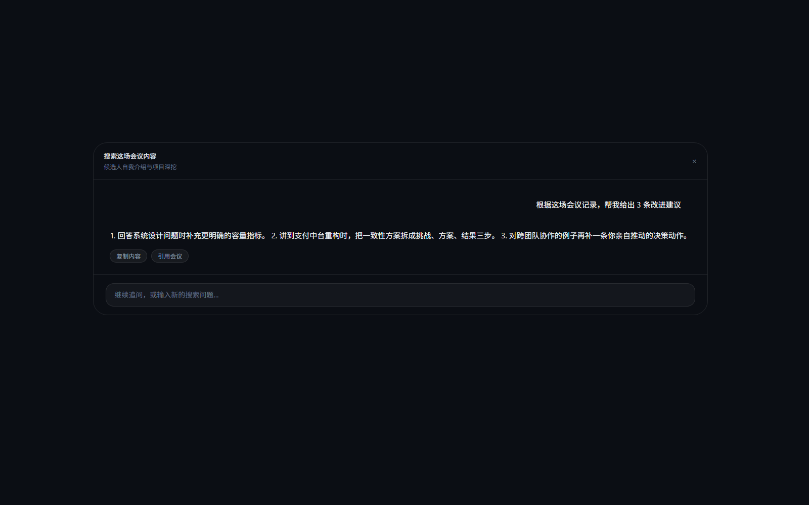

### 4.3 全局搜索

**用途**  
跨全部会议记录搜索长期趋势、共性问题或重复出现的薄弱项。

**入口**  
首页顶部搜索栏，或相关搜索入口。

**操作步骤**
1. 在全局搜索中输入你的问题。
2. 等待系统检索全部会议并生成汇总回答。
3. 根据回答继续缩小范围，或改成单场会议继续追问。

**结果**  
你可以快速看出自己在多场会议中的共性表现。

**注意事项**  
如果你已经明确只关心某一场会议，请改用“会议内追问”，避免结果过于概括。

**配图**  
图 4-3 全局搜索  
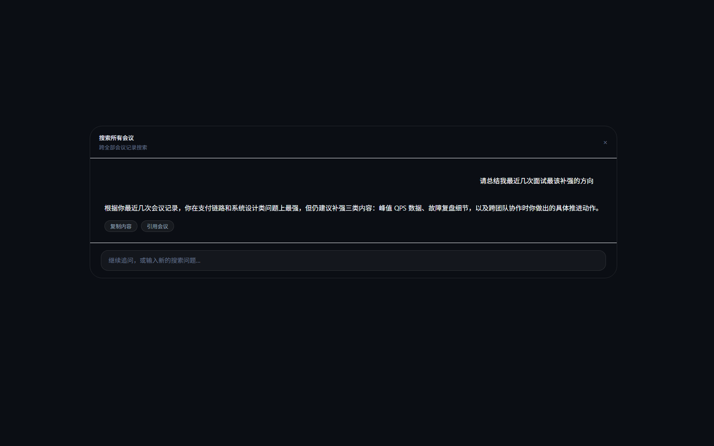

## 5. 设置中心

### 5.1 通用

**用途**  
管理可检测状态、开机启动、主题、AI 回复语言、版本检查与界面透明度。

**入口**  
首页右上角设置按钮。

**操作步骤**
1. 打开设置并进入“通用”页。
2. 根据需要调整开机启动、主题和 AI 回复语言。
3. 使用透明度滑杆微调会议中界面的可见程度。

**结果**  
这些设置会影响全局使用体验，而不是某一场会议。

**注意事项**  
透明度越低越不显眼，但也可能降低可读性；建议先在会议前预览一次。

**配图**  
图 5-1 通用设置  
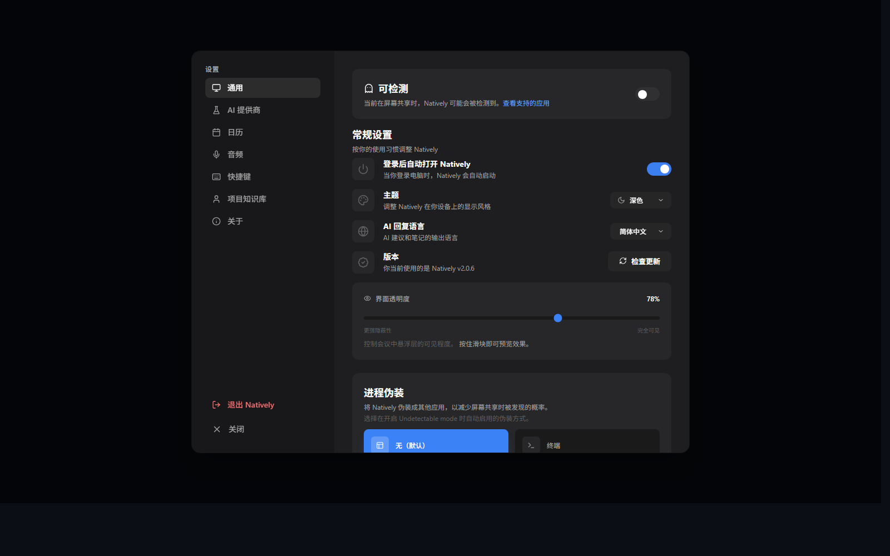

### 5.2 AI 提供商

**用途**  
配置聊天默认模型、快速回复模式、托管模式、云端模型、自定义提供商与本地模型。

**入口**  
设置中的“AI 提供商”页。

**操作步骤**
1. 先选择默认聊天模型。
2. 根据账号状态决定是否开启托管模式或快速回复模式。
3. 在云端提供商区域填写对应 API Key，或新增自定义提供商。
4. 如已安装本地模型，也可切换到本地模型使用。

**结果**  
模型可用性、默认选项和后续回答风格会一起更新。

**注意事项**  
托管模式适合普通用户快速上手；BYOK、自定义提供商和本地模型更适合有明确模型策略的用户。

**配图**  
图 5-2 AI 提供商设置  
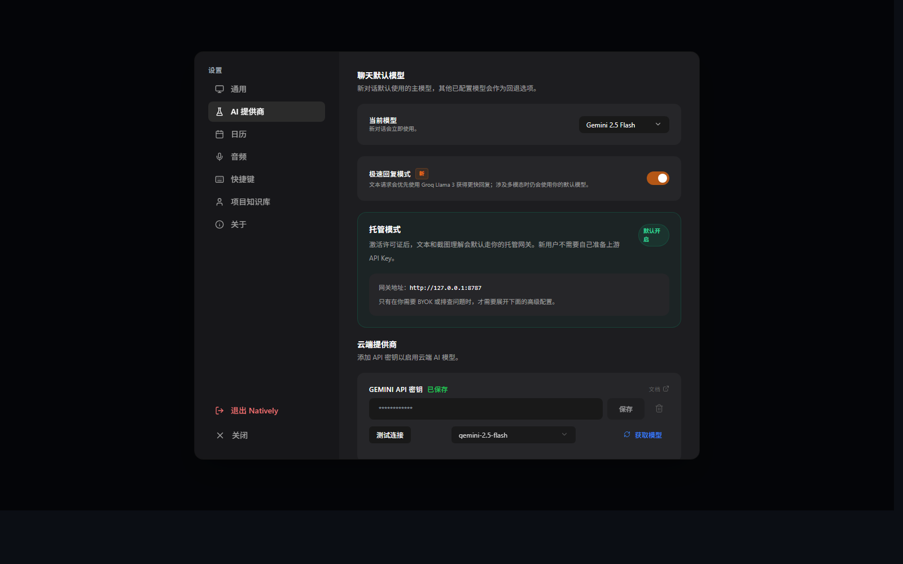

### 5.3 日历

**用途**  
连接或断开 Google 日历。

**入口**  
设置中的“日历”页。

**操作步骤**
1. 打开“日历”页查看当前连接状态。
2. 如未连接，点击连接按钮完成授权。
3. 如已连接，可在这里断开并更换账号。

**结果**  
设置页会展示当前绑定邮箱，首页也会同步显示最新状态。

**注意事项**  
断开日历后，首页将不再自动获取未来事件，但历史会议不会被删除。

**配图**  
图 5-3 日历设置  
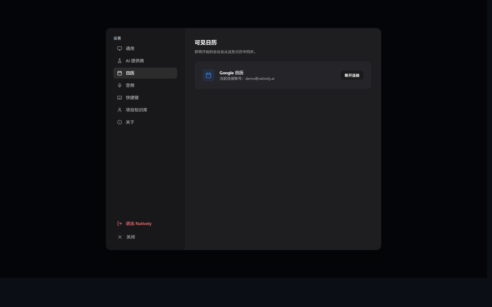

### 5.4 音频

**用途**  
配置 STT 提供商、音频输入输出设备、热词表和音频测试。

**入口**  
设置中的“音频”页。

**操作步骤**
1. 选择实时转写提供商。
2. 绑定或核对输入设备、输出设备。
3. 如需要提升术语识别效果，可维护热词表。
4. 使用音频测试确认麦克风电平是否正常。

**结果**  
会议中转写质量与设备路由会按你的设置生效。

**注意事项**  
如果会议中转写异常，先检查输入设备是否正确，再检查 STT 提供商与密钥状态。

**配图**  
图 5-4 音频设置  
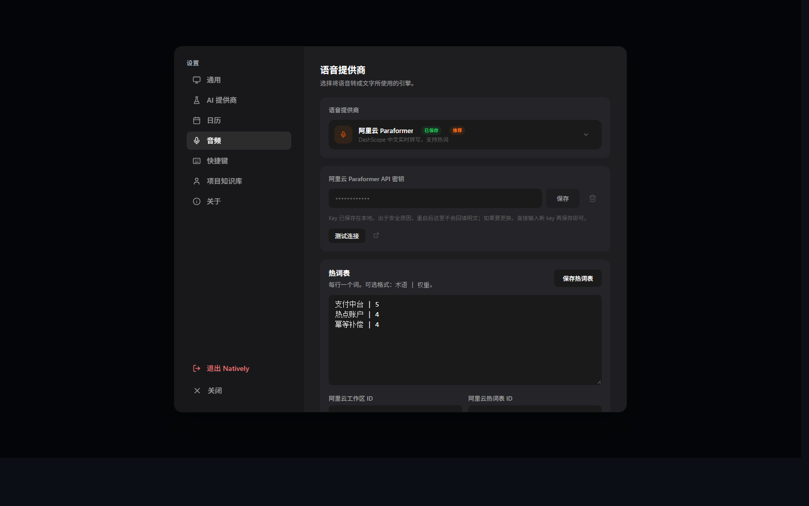

### 5.5 快捷键

**用途**  
修改会议中常用动作和窗口控制的快捷键。

**入口**  
设置中的“快捷键”页。

**操作步骤**
1. 打开“快捷键”页查看当前配置。
2. 点击某个快捷键项并录入新的按键组合。
3. 如果需要回到默认值，可使用重置功能。

**结果**  
新的按键会立即影响会议中动作触发方式。

**注意事项**  
建议优先配置最常用的几个动作，比如“怎么回答”“精简”“截图”“切换可见状态”。

**配图**  
图 5-5 快捷键设置  
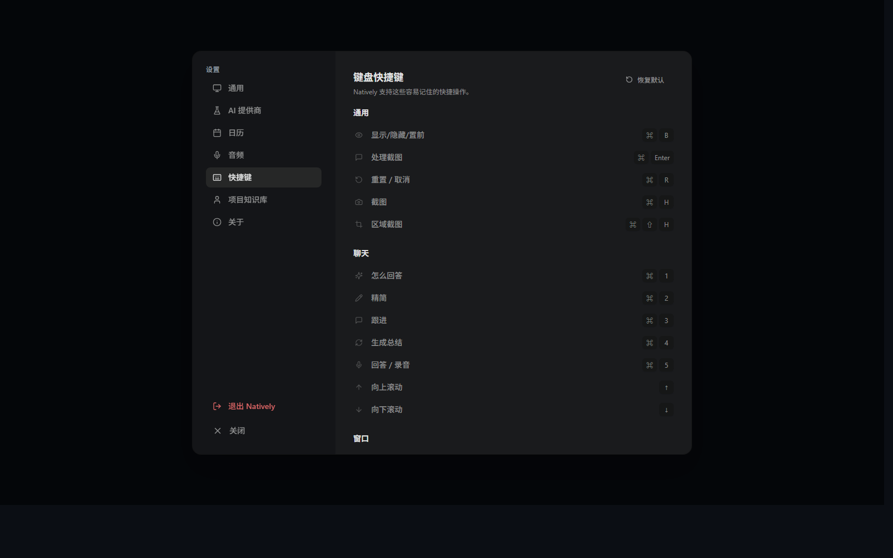

### 5.6 职业画像

**用途**  
导入简历、维护项目库、启用 JD 偏置，并让 AI 回答更贴近你的真实经历。

**入口**  
设置中的“项目知识库”页。

**操作步骤**
1. 上传简历文件，先查看预览结果。
2. 选择要写入的项目数量并确认导入。
3. 根据需要启用画像引擎、回答模式和 JD 偏置。
4. 在项目库中启用或停用某些项目，让会议回答更聚焦。

**结果**  
会议中的推荐回答和会后搜索会开始引用项目证据与简历信息。

**注意事项**  
这项能力更适合面试、汇报、复盘等需要“贴近个人经历”表达的场景。

**配图**  
图 5-6 职业画像 / 项目知识库  
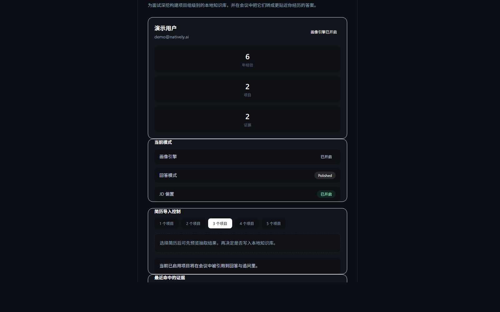

### 5.7 关于

**用途**  
快速访问官网、下载页、授权购买、许可证找回与商业化说明。

**入口**  
设置中的“关于”页。

**操作步骤**
1. 打开“关于”页。
2. 根据目的选择官网、下载、购买或找回入口。
3. 如需对外介绍产品，也可把这页当作外部资源聚合页使用。

**结果**  
你可以在不离开应用上下文的情况下完成常见外链跳转。

**注意事项**  
这一页偏“资源入口”，不是功能配置页；实际激活操作请前往授权中心。

**配图**  
图 5-7 关于页  
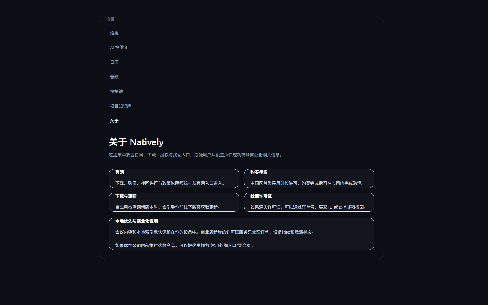

## 6. 授权与升级

### 6.1 打开授权中心

**用途**  
查看授权状态、设备 ID、到期时间，并执行激活或停用。

**入口**  
授权弹窗 / 授权中心。

**操作步骤**
1. 打开授权中心。
2. 在左侧输入许可证，核对设备 ID。
3. 点击激活，或在已激活状态下执行停用。

**结果**  
你可以看到当前授权状态、到期时间和购买/找回入口。

**注意事项**  
如果需要换设备，建议先在旧设备停用，再在新设备激活。

**配图**  
图 6-1 授权中心  
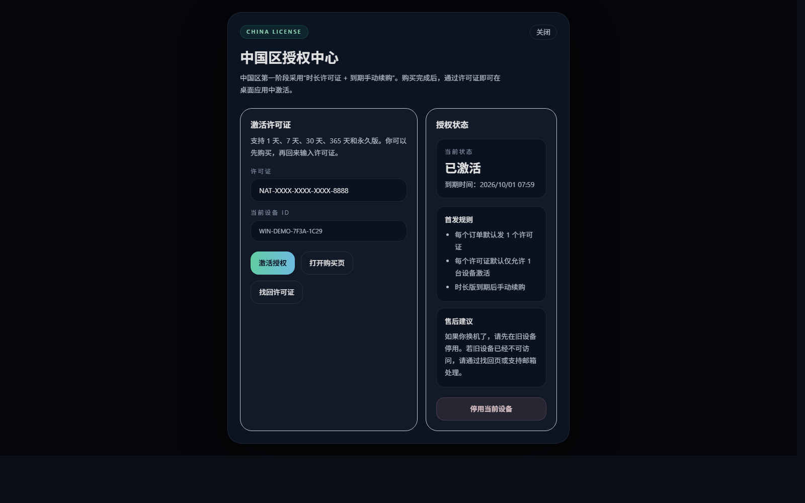

### 6.2 适合什么时候升级

**用途**  
帮助你判断是否需要从基础使用升级到带授权的完整能力。

**入口**  
阅读授权中心中的授权状态与购买入口。

**操作步骤**
1. 先确认你是否需要托管能力、职业画像或更完整的商业化支持。
2. 如需要，打开购买入口获取许可证。
3. 获取许可证后回到授权中心激活。

**结果**  
付费能力会以许可证状态为准生效。

**注意事项**  
购买、找回与下载是不同入口；“授权中心”负责激活状态，而“关于页”负责外部资源跳转。

**配图**  
图 6-1 授权中心信息区  

## 7. 提示词实验室

### 7.1 入口与作用

**用途**  
预览某个 AI 动作真正会收到哪些输入，并微调可编辑部分。

**入口**  
从相关功能入口打开“提示词实验室”。

**操作步骤**
1. 打开提示词实验室。
2. 在左侧选择要查看的动作。
3. 在中间选择字段，在右侧查看完整内容。

**结果**  
你能看到“固定提示词 + 会议动态字段 + 运行时字段 + 转写摘要”是如何拼成一次调用输入的。

**注意事项**  
提示词实验室是预览与调优工具，不是普通使用流程中的必经步骤。

**配图**  
图 7-1 提示词实验室  
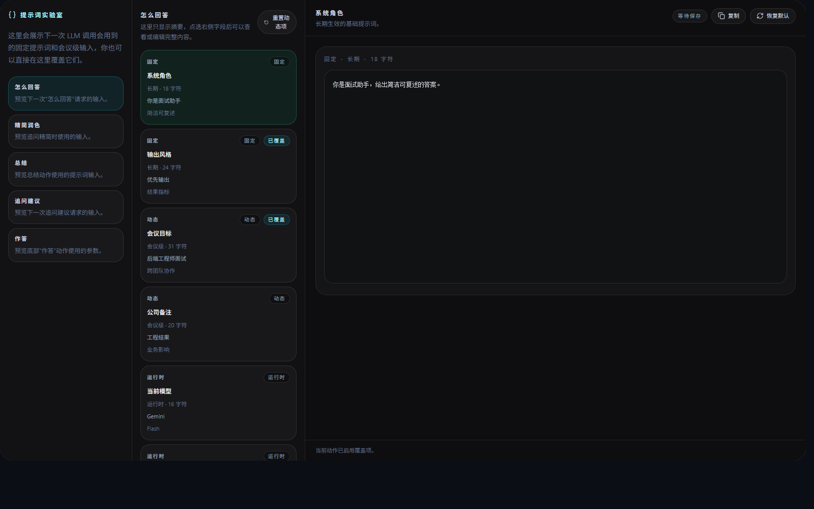

### 7.2 五类动作

**用途**  
明确每个动作对应的调用场景。

**入口**  
提示词实验室左侧动作列表。

**操作步骤**
1. 选择“怎么回答”：预览当前主推荐动作的输入。
2. 选择“精简润色”：预览压缩已有答案时使用的输入。
3. 选择“总结”：预览阶段性总结动作的输入。
4. 选择“追问建议”：预览下一轮建议问题的输入。
5. 选择“作答”：预览底部“作答”动作的完整参数。

**结果**  
你可以按动作逐个理解输入结构，而不是笼统地看一大段提示词。

**注意事项**  
建议先从“怎么回答”开始看，因为它通常最贴近日常使用频率。

**配图**  
图 7-1 动作列表  

### 7.3 字段说明

**用途**  
区分哪些字段是长期规则，哪些字段会随会议变化。

**入口**  
提示词实验室中间字段列表。

**操作步骤**
1. 查看“固定”字段：长期生效的基础规则。
2. 查看“动态”字段：当前会议级别的补充信息。
3. 查看“运行时”字段：当前模型、最近问题等临时上下文。
4. 查看“转写”字段：由转写压缩后的摘要信息。

**结果**  
你会知道某段提示词到底属于“全局规则”还是“本次会议上下文”。

**注意事项**  
判断字段来源后，再去修改会更安全，避免把一次性的内容写成长期规则。

**配图**  
图 7-1 字段列表  

### 7.4 可编辑与不可编辑内容

**用途**  
避免误改只读上下文。

**入口**  
提示词实验室右侧编辑区。

**操作步骤**
1. 优先修改“固定”与“动态”字段。
2. 把“运行时”和“转写”字段视为预览内容，只用来理解输入，不直接修改。
3. 保存后再次切回该动作确认是否符合预期。

**结果**  
你能在不破坏系统运行时上下文的前提下完成调优。

**注意事项**  
如果某个字段明显来自当前会议现场，通常就不应该长期写死。

**配图**  
图 7-1 编辑区  

### 7.5 重置、复制与适用场景

**用途**  
安全试验提示词，并保留回退手段。

**入口**  
提示词实验室右上角操作区。

**操作步骤**
1. 需要复用内容时，使用复制按钮。
2. 需要恢复原始值时，使用重置当前字段或恢复默认值。
3. 在面试、汇报、售前演示等不同场景下，分别为动作建立更贴合的固定或动态提示。

**结果**  
你可以低风险迭代提示词，而不是一次改动影响全部输出。

**注意事项**  
建议一次只改一个字段，然后回到真实会议场景里验证效果。

**配图**  
图 7-1 复制与重置入口  

## 8. 常见问题

### 8.1 为什么首页没有即将开始的会议？

先确认 Google 日历是否已经连接，再使用首页刷新按钮。如果设置页中已连接但首页仍为空，通常是当前时间窗口内没有可同步事件。

### 8.2 什么时候用“会议内追问”，什么时候用“全局搜索”？

只围绕一场会议复盘时，用“会议内追问”；想看多场会议的共性问题或长期趋势时，用“全局搜索”。

### 8.3 截图附加最适合哪些场景？

适合页面讲解、图表分析、代码题、系统设计图、题面截图这类“只靠语音上下文不够”的场景。

### 8.4 职业画像一定要先配置吗？

不是。普通会议记录、会中辅助和会后搜索都能直接用；职业画像更像增强层，适合面试和个人表达场景。

### 8.5 提示词实验室适合谁用？

适合已经明确知道自己想优化哪类回答的人。普通用户可以先不碰这项能力，等熟悉基础流程后再使用。

## 附录：主流程核对清单

1. 首次打开应用后，能看到首页、最近会议、设置入口和开始会议按钮。
2. 连接日历后，首页会显示日历已关联状态，并允许刷新。
3. 开始会议后，悬浮助手能展示转写、动作按钮、输入区和模型入口。
4. 打开会议详情后，能查看摘要并继续围绕这场会议追问。
5. 打开提示词实验室后，能看到 5 类动作、字段列表、编辑区以及复制/重置入口。

## 附录：不在本文范围内的页面

本文不覆盖以下内部或诊断用途页面：调用链、原始转写、Fun-ASR 对比、Queue、Solutions、Debug，以及其他历史调试页。
